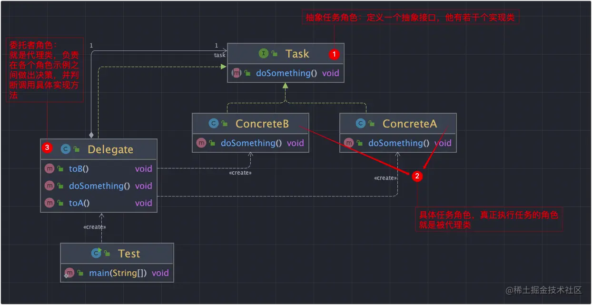
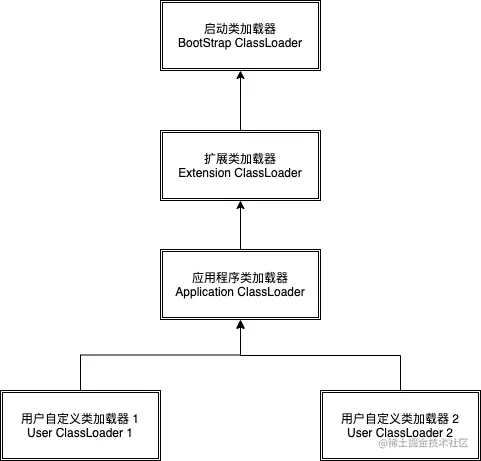
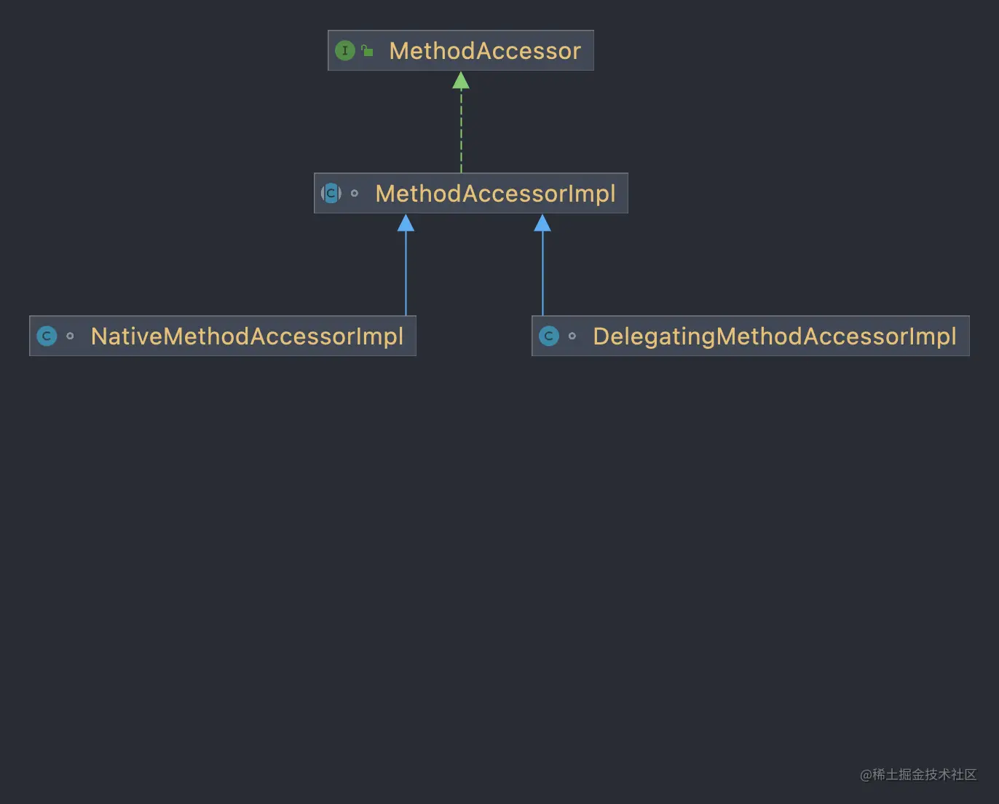

### 委派模式（Delegate Pattern）

#### 1.定义

委派模式(Delegate Pattern）又叫委托模式，是一种面向对象的设计模式，允许对象组合实现与
继承相同的代码重用。它的基本作用就是负责任务的调用和分配任务，是一种特殊的静态代理，可以理
解为全权代理，但是代理模式注重过程，而委派模式注重结果。委派模式属于行为型模式，不属于 GOF
23 种设计模式中。
> 俗点讲就是有两个对象参与(两个对象协同)处理同一个请求，接受请求的对象将请求委托给另一个对象来处理。

#### 2.应用场景

1）委派对象本身不知道如何处理一个任务或一个请求，把请求交给其他对象来处理。
2）可以实现程序的解耦

#### 3.UML图



#### 4.委派模式优缺点

优点：

1. 通过任务委派能够将一个大型的任务细化。
2. 将应用相关的内容与框架完全分离开
3. 避免过多的子类以及子类与父类的耦合
4. 通过委托传递消息机制实现分层解耦

缺点：
任务委派方式需要根据任务的复杂程度进行不同的改变，在任务比较复杂的情况下可能需要进行多 重委派，容易造成紊乱。

#### 5.框架源码分析

- JDK ClassLoader：

> JVM的类加载机制是双亲委派机制，下图是整体的ClassLoader加载逻辑图



```java
class ClassLoaderDemo {
    protected Class<?> loadClass(String name, boolean resolve)
            throws ClassNotFoundException {
        synchronized (getClassLoadingLock(name)) {
            // First, check if the class has already been loaded
            Class<?> c = findLoadedClass(name);
            if (c == null) {
                long t0 = System.nanoTime();
                try {
                    // 这里实现了双亲委派的核心逻辑
                    if (parent != null) {
                        c = parent.loadClass(name, false);
                    } else {
                        c = findBootstrapClassOrNull(name);
                    }
                } catch (ClassNotFoundException e) {
                    // ClassNotFoundException thrown if class not found
                    // from the non-null parent class loader
                }

                if (c == null) {
                    // If still not found, then invoke findClass in order
                    // to find the class.
                    long t1 = System.nanoTime();
                    c = findClass(name);

                    // this is the defining class loader; record the stats
                    PerfCounter.getParentDelegationTime().addTime(t1 - t0);
                    PerfCounter.getFindClassTime().addElapsedTimeFrom(t1);
                    PerfCounter.getFindClasses().increment();
                }
            }
            if (resolve) {
                resolveClass(c);
            }
            return c;
        }
    }
}
```

- JDK Method:

> JDK的反射中经常会使用到Method类，在具体的invoke方法中，Method将实际调用的逻辑交给MethodAccessor实现。MethodAccessor便是delegate类的抽象接口。

```java
class MethodDemo {
    @CallerSensitive
    @ForceInline // to ensure Reflection.getCallerClass optimization
    @IntrinsicCandidate
    public Object invoke(Object obj, Object... args)
            throws IllegalAccessException, IllegalArgumentException,
            InvocationTargetException {
        if (!override) {
            Class<?> caller = Reflection.getCallerClass();
            checkAccess(caller, clazz,
                    Modifier.isStatic(modifiers) ? null : obj.getClass(),
                    modifiers);
        }
        MethodAccessor ma = methodAccessor;             // read volatile
        if (ma == null) {
            ma = acquireMethodAccessor();
        }
        return ma.invoke(obj, args);
    }
}
```

```java
public interface MethodAccessor {
    /** Matches specification in {@link java.lang.reflect.Method} */
    public Object invoke(Object obj, Object[] args)
            throws IllegalArgumentException, InvocationTargetException;
}
```



- Spring BeanDefinition:

> BeanDefinition的主要职责是封装配置信息的在内存的状态。
> DefaultBeanDefinitionDocumentReader的doRegisterBeanDefinitions方法中使用createDelegate创建委托类。

- SpringMVC DispatcherServlet

> DispatcherServlet实现了针对不同的HttpRequest处理不同的任务，本身不处理任务，是负责Request的调度。

```java
class DispatcherServletDemo {
    protected void doDispatch(HttpServletRequest request, HttpServletResponse response) throws Exception {
        HttpServletRequest processedRequest = request;
        HandlerExecutionChain mappedHandler = null;
        boolean multipartRequestParsed = false;

        WebAsyncManager asyncManager = WebAsyncUtils.getAsyncManager(request);

        try {
            ModelAndView mv = null;
            Exception dispatchException = null;

            try {
                processedRequest = checkMultipart(request);
                multipartRequestParsed = (processedRequest != request);

                // Determine handler for the current request.
                mappedHandler = getHandler(processedRequest);
                if (mappedHandler == null) {
                    noHandlerFound(processedRequest, response);
                    return;
                }

                // Determine handler adapter for the current request.
                HandlerAdapter ha = getHandlerAdapter(mappedHandler.getHandler());

                // Process last-modified header, if supported by the handler.
                String method = request.getMethod();
                boolean isGet = "GET".equals(method);
                if (isGet || "HEAD".equals(method)) {
                    long lastModified = ha.getLastModified(request, mappedHandler.getHandler());
                    if (logger.isDebugEnabled()) {
                        logger.debug("Last-Modified value for [" + getRequestUri(request) + "] is: " + lastModified);
                    }
                    if (new ServletWebRequest(request, response).checkNotModified(lastModified) && isGet) {
                        return;
                    }
                }

                if (!mappedHandler.applyPreHandle(processedRequest, response)) {
                    return;
                }

                // Actually invoke the handler.
                mv = ha.handle(processedRequest, response, mappedHandler.getHandler());

                if (asyncManager.isConcurrentHandlingStarted()) {
                    return;
                }

                applyDefaultViewName(processedRequest, mv);
                mappedHandler.applyPostHandle(processedRequest, response, mv);
            } catch (Exception ex) {
                dispatchException = ex;
            } catch (Throwable err) {
                // As of 4.3, we're processing Errors thrown from handler methods as well,
                // making them available for @ExceptionHandler methods and other scenarios.
                dispatchException = new NestedServletException("Handler dispatch failed", err);
            }
            processDispatchResult(processedRequest, response, mappedHandler, mv, dispatchException);
        } catch (Exception ex) {
            triggerAfterCompletion(processedRequest, response, mappedHandler, ex);
        } catch (Throwable err) {
            triggerAfterCompletion(processedRequest, response, mappedHandler,
                    new NestedServletException("Handler processing failed", err));
        } finally {
            if (asyncManager.isConcurrentHandlingStarted()) {
                // Instead of postHandle and afterCompletion
                if (mappedHandler != null) {
                    mappedHandler.applyAfterConcurrentHandlingStarted(processedRequest, response);
                }
            } else {
                // Clean up any resources used by a multipart request.
                if (multipartRequestParsed) {
                    cleanupMultipart(processedRequest);
                }
            }
        }
    }
}
```